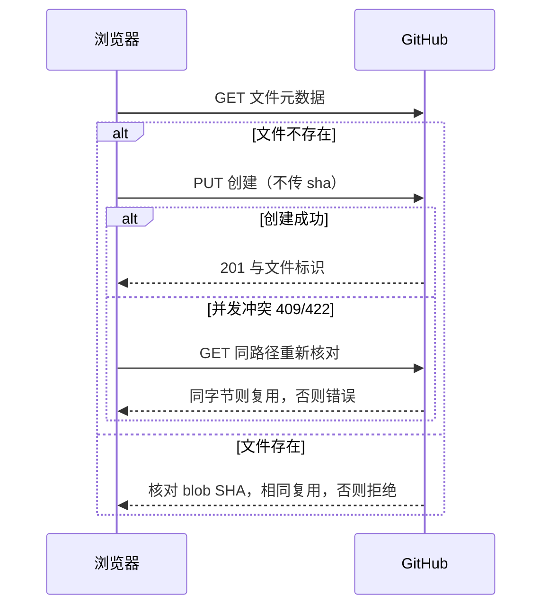

# 静态图床 · 实现合同

来源与范围：[概要及原始确认需求](概要设计.md)。状态：授权范围内实施；本文先于实现记录合同。

D-004/D-005 保留原单仓库实现约束；用户于 2026-09-29 授权实施的多仓库行为见 [D-006](概要设计.md#D-006) 和 D-007，冲突处以新合同为准。历史验证不覆盖新能力。

## D-004 · 配置、文件与 Git 写入

初版历史配置：用户于 2026-09-28 确认固定使用 `hugh-zhan9/hugh-image` 的 `main` 分支及 GitHub 原始图片地址，不需要更改。页面移除 owner、repo、branch、publicBaseUrl 四项输入，不再读取或保存浏览器仓库配置（包括旧的 `hugh-images-settings-v1`），仅接收用户输入的 Token。仓库元数据的默认分支名为 `main`（核对时仓库为空，该分支尚未初始化）。内部配置校验继续拒绝文章仓库、非法标识及 ref。连接验证仓库公开、分支存在；不通过写文件测试权限。

第一版每批最多 20 张、单张最多 10 MiB。仅接收可解码 JPEG/PNG/WebP/GIF，拒绝 SVG 和伪造格式。默认 JPEG/PNG 缩至最长边 2000px 并转 WebP（质量 0.85），可关闭；GIF/WebP 保留原文件避免动画丢失。解码像素上限 40MP。压缩输出若更大则保留原图，这是明确的压缩策略而非错误回退。

路径：`images/<SHA-256 前两位>/<SHA-256>.<实际格式>`，SHA-256 基于最终上传字节。无共享可变索引文件；图片列表由 Git Trees API 的分支快照获取。递归结果截断须报错，不把部分列表当完整结果。列表分页仅影响浏览器展示，不改变远程文件。

API 固定 `https://api.github.com`；GET 元数据、树和内容元数据，PUT Contents 只带 message/content/branch，不带更新用 sha；绝不使用 DELETE、PATCH 或强推。已有文件的 Git blob SHA-1 必须与本地字节计算结果一致才能复用，路径相同但内容不同则报错。

不执行自动重试。30 秒超时或网络中断可能发生于 GitHub 已写入之后，界面提示结果未确认，用户重新上传同图会走上述核对。串行写入避免单页面分支竞争；跨页面冲突通过只创建与内容核对解决，不覆盖其他写入。只新增不存在本应用引发的 ABA 删除重建；外部修改已存在文件会被哈希核对拒绝。

## D-005 · 界面与安全边界

连接、上传和列表均由 images 应用拥有。连接/上传期间锁定 Token 输入；清除 Token 后断开，已有公开图片链接仍可浏览。未输入 Token 不发送写请求。输入和远端文件名仅作为 React 文本渲染；图片链接逐段编码，Markdown 标题转义；外链不携带 Token。

上传状态：等待 → 处理中 → 上传中 → 已入库/已存在/失败。已结束的项目不会被一键上传重复执行；失败项目可由用户主动重试；清空仅清理本地队列。允许混合批次独立成功失败，并逐张保留结果。列表请求失败必须显示错误，空数组才显示空状态。

生产页面使用 CSP：脚本仅同源，连接仅 GitHub API，禁止 frame/object/base 注入；图片允许 HTTPS 与本地 blob/data；不加载第三方脚本。主题通过同源副本执行，颜色 CSS 来自根 tokens。Token 不进入持久化配置；错误不回显请求头或不可信远程错误正文。构建不接受 Token 环境变量。

## D-007 · 仓库池实现合同

来源：[D-006](概要设计.md#D-006) 及用户“开始吧”；状态：已按授权实现并通过下述验证；用户已授权并完成创建公开仓库 hugh-image-02、hugh-image-03，main 已初始化，原 hugh-image 保留。

- 配置：images 源码维护非空仓库数组；复用 Settings 校验，拒绝重复 owner/repo（不区分大小写），不能把文章仓库加入池。旧仓库必须保留以浏览和复用旧图；无浏览器配置入口或存储。一个临时 Token 用于全部客户端，连接只验证全部仓库公开且分支存在，任一失败则整体不连接。dispose 清除全部客户端凭据并中止请求。
- 占用：沿用 list 的 images/ 普通图片文件范围，累计 size；匹配图片的非法 size/sha 不静默跳过，失败/截断不提交部分统计。上传批次开始刷新所有仓库；只有完整读取成功才替换统计。无图片为零，单仓库行为保持可用。统计不是 Git 磁盘容量或平台配额。
- 分配：处理最终字节后，逐仓 GET 同路径核对；任一同路径不同内容拒绝该图片，读取失败不当不存在。有相同内容时按配置顺序复用首个已存在位置，不新增。全无则取占用最小者，平局按配置顺序。成功后更新该仓库路径记录和占用；并发导致目标返回 existing 时也补入未见路径，避免统计低估。
- 失败：批次初始读取失败，全批不写，队列保持可重试；单图解码/核对/创建失败保留之前成功，其他图片按现有逐张模式继续。写入尝试失败后丢弃过期统计，下一张写入前重新读完整列表；同一页面会话内该内容重试固定原目标，避免未知结果时改投其他仓库。无自动重试和自动故障转移。多个页面仅尽量均衡，不承诺跨仓严格唯一或全局原子快照。
- 展示：池返回 path/size/sha 加来源唯一 key 和原始 URL；图库按 path 再按来源稳定排序，仍每次显示 60 张。相同路径在不同仓库不发生 React key 冲突；所有外链由实际来源生成。读取任何一个仓库失败，图库显示错误，不展示冒充完整的部分列表。旧文件、提交和原有链接不改写。
- 所属与范围：新 pool 模块只编排既有 GitHubImages，页面只依赖池的 connect/list/prepareBatch/upload/dispose；原始 API 创建语义及只向 api.github.com 发送 Token 保留。仓库池配置不包含凭据。不改全站构建、跑步或博客行为。

验证范围：空/单/多池、重复配置、不同大小及每张完成后的再分配、旧图复用、同路径冲突、读取失败/截断/非法大小、部分批次失败、未知写入后固定目标重试、并发 existing 计数、连接/清理凭据；浏览器验证跨仓上传、来源 URL、汇总列表、旧链接、无选择入口、已有上传交互和响应式。图床检查、根组合构建调用方测试、生产浏览器回归及独立最终 diff 审查完成后记录结果。

## 验证与交接

Design Contract Index：[D-001](概要设计.md#D-001)、[D-002](概要设计.md#D-002)、[D-003](概要设计.md#D-003)、[D-004](#D-004)、[D-005](#D-005)、[D-006](概要设计.md#D-006)、[D-007](#D-007)。

Verification Strategy：单元测试覆盖配置约束、同内容去重、冲突核对、拒绝覆盖、401/403/404/429/超时、空/截断列表、顺序写入；浏览器以模拟 GitHub API 覆盖真实图片解码/压缩、选择/粘贴/拖拽、部分批次失败、Token 不落盘/刷新失效、复制、移动端/暗色；根测试与组合构建覆盖新增子应用及原有调用方。预期拒绝的路径均不可产生修改或删除请求。

设计推演：首次创建和重复上传均只新增或复用；并发冲突不能覆盖；中途失败保留此前成功文件并逐项报告。字段、链接与合同已人工检查；Mermaid 尚未渲染验证。运行结果与独立审查完成后补入本节。

### 2026-09-28 实现验证

- 图床 19 项单元测试通过，类型检查、Prettier 检查与独立生产构建通过。
- 生产构建浏览器回归通过：真实 PNG 解码压缩、选择/粘贴/拖拽、三张中一张失败及手动重试、重复上传不新增、内容伪装拒绝、20/21 张队列边界、URL/Markdown 复制、预览 Escape 关闭、空/失败/截断图片库、Token 不落盘与刷新清除、存储被拒绝、暗色/自定义主题及 320/375/768/1440px 无横向溢出。GitHub API 均被拦截，仅 4 次模拟写请求，未修改真实仓库。
- 已查看桌面上传完成和移动端暗色截图；本文文件链接及 D 锚点检查通过。Mermaid 未做渲染验收。
- 原有主页 13 项和跑步 40 项测试通过；跑步类型检查、独立生产构建通过，跑步页面新增图床导航在真实浏览器 320/375/1440px 下可见且无导航溢出。根 Node 检查 22 项中 21 项通过，唯一失败与基线相同。pnpm 8.9.0 frozen-lockfile 离线安装检查通过。
- 全站真实构建由 Hugo Extended 0.165.0 执行，因原有 `content/crazy-talk/2026-09-23.md:4` 的 `date: 026-09-23T00:00:00+08:00` 失败，未修改该文件、未绕过检查。组合构建的成功路径、三个应用各自失败时保留旧站点的测试通过；这不等于全站真实构建通过。
- 独立只读审查 `/root/images_security_review` 审查指定 diff、新文件及后续 Token dispose 修订，未发现 Critical/Important 问题。审查不替代运行测试。
- 未验证真实 Token 上传、GitHub 限额或线上外链访问；未提交、推送、创建远程仓库或部署。

### 固定仓库界面修订验证

- 删除四项配置输入和仓库配置持久化，旧配置不影响 API 目标或外链。移除已失效的配置持久化单元测试后，18 项单元测试、类型检查、格式检查、独立生产构建通过。
- 生产浏览器回归通过，新增断言覆盖旧配置存在时固定仓库、main 分支及 raw 外链；检查桌面和移动端截图，Token 输入占满移动端可用宽度。仅执行模拟 GitHub 写入。
- `/root/images_security_review` 对本次配置移除作独立只读复核，未发现 Critical/Important 问题。

### 分支读取错误提示修订

- 公开 API 实查：仓库元数据返回 200、分支列表为空、main 返回 404。连接中的分支 404 现提示先添加 README 初始化分支，或核对已有分支的 Token 授权；其他 HTTP 错误保持原有语义。不自动写入初始化文件。
- 19 项单元测试、类型检查、格式检查、生产构建与浏览器模拟回归通过；新增分支 404 提示及无写请求断言。未使用真实 Token 验证授权，未修改远程仓库。

Planning Handoff：用户已授权实现，不另设审批。仓库名、分支及外链固定；仅 Token 由用户运行时输入，不创建远程仓库或写入真实图片。部署仍需单独授权。

### 推送前与最新远端整合

用户已授权提交并推送。远端 main 已修正上述日期问题，并更新跑步数据；在基于 `3a0d6ae` 的独立工作区整合图床改动，未带入仅存在于原本地历史的 AI 跑步建议提交。

整合后图床 19 项、主页 13 项、根 Node 21 项、跑步 27 项测试及 crazy-talk 契约检查通过；两个应用类型检查、图床格式检查和 Hugo/跑步/图床真实组合生产构建通过。此前日期阻塞仅适用于原本地基线，已不影响本次推送版本。图片仓库 main 已按用户授权通过 README 初始化，未使用真实 Token 上传图片验收。

### 2026-09-29 多仓库验证

- 图床 35 项单元测试、TypeScript 类型检查、Prettier 检查通过；根组合构建调用方 4 项测试通过。图床独立生产构建成功。
- 生产页面 Chromium 回归通过：按容量跨仓写入、重复内容复用、旧仓库文件/URL 保留、初始列表读取失败不写入、部分上传失败与固定目标手动重试、来源正确的链接复制、汇总列表失败/截断、不同仓库相同路径、65 张跨仓分页、Token 清空/刷新失效、存储不可用、主题及 320/375/768/1440px 无横向溢出。全部图片写入均为模拟请求，共 4 次 PUT；没有用本机凭据代替页面 Token 做真实图片上传。
- 已查看桌面图库截图，旧图与各仓库新图统一展示，未增加仓库选择入口。原浏览器测试失败点为点击已删除的“清除 Token”按钮，本轮改为清空输入并保留断开与凭据清空检查。
- 用户明确授权创建并初始化 hugh-image-02、hugh-image-03；真实 GitHub 返回两者为公开仓库，main 分支读取成功，初始化提交分别为 a3423b8b706fe966b4f9d583fda1ade4803e7f4c、477dc68ced31ad361f5c5bb1573d0c004bffba03。未改动原图片仓库。
- 截至本地实现验证，未运行完整博客/跑步测试或全站真实组合构建，未修改其代码或构建流程；未验证用户的真实页面 Token 写权限。当时未提交、推送或部署站点；用户随后授权提交并部署，完整发布检查由对应提交的 CI 工作流执行。

- 独立只读审查 `/root/images_pool_review` 未发现 Critical/Important 问题；两处历史单仓库状态/范围文案 Minor 已修正并检查。审查者独立运行 35 项单测通过，浏览器结果来自主代理运行。
